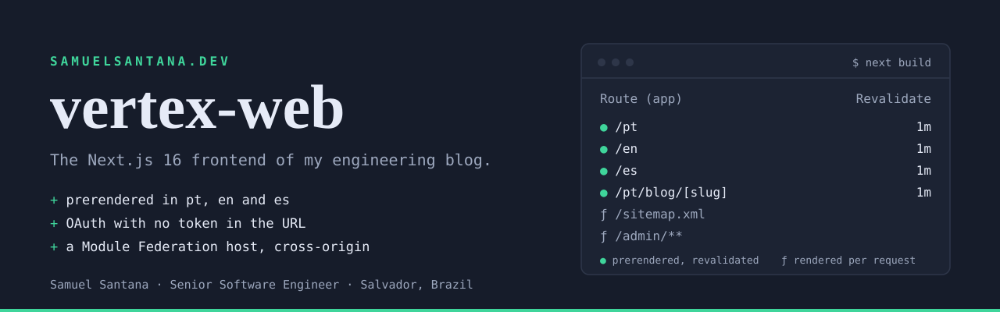
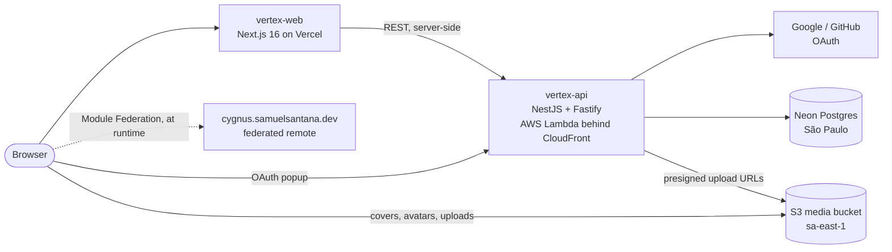

<p align="center">
  <a href="https://www.samuelsantana.dev"></a>
</p>

<p align="center">
  <a href="https://www.samuelsantana.dev"><strong>Live site</strong></a> ·
  <a href="https://www.samuelsantana.dev/micro-frontends">Module Federation demo</a> ·
  <a href="https://github.com/samuelcsantana/vertex-api">vertex-api (backend)</a> ·
  <a href="https://www.linkedin.com/in/samuelcsantana">LinkedIn</a>
</p>

<p align="center">
  <a href="https://github.com/samuelcsantana/vertex-web/actions/workflows/ci.yml"></a>
  <a href="https://github.com/samuelcsantana/vertex-web/actions/workflows/tests.yml"></a>
  <a href="https://github.com/samuelcsantana/vertex-web/actions/workflows/security.yml"></a>
  <a href="./LICENSE"></a>
</p>

This is the frontend of [samuelsantana.dev](https://www.samuelsantana.dev), my engineering blog: long-form posts in Portuguese, English and Spanish, comments with Google, GitHub or email-code sign-in, an admin panel, and two live demos of cross-origin frontend integration. It is the production app behind the site, built and maintained by me, **Samuel Santana**, a Senior Software Engineer in Salvador, Brazil.

## What to look at

| Area | What it does | Where |
|---|---|---|
| **Rendering** | Every public page is prerendered in the three locales: home, About, the OAuth callback and every post page. Pages built from API content revalidate every 60 s. Only the admin panel, the API route handlers and the sitemap render per request. | `src/app/[locale]/(blog)/`, `next build` |
| **Auth** | The OAuth popup goes to vertex-api, which redirects back to `/auth/callback` with a short-lived, single-use exchange code, never the token. A Server Action trades the code server-to-server and sets an `HttpOnly` cookie, and a `BroadcastChannel` tells the page that opened the popup. | `src/app/[locale]/auth/callback/`, `src/features/auth/actions/auth-actions.ts` |
| **Signed-in state on static pages** | Public pages never read cookies, so they stay prerendered. `CurrentUserProvider` asks `GET /api/me` once, and `useCurrentUser()` tells "not answered yet" apart from "signed out", so a signed-in reader does not get a logged-out flash. | `src/features/auth/components/CurrentUserProvider.tsx`, `src/app/api/me/` |
| **i18n** | pt (unprefixed), `/en` and `/es` are real, crawlable URLs, routed by next-intl in `src/proxy.ts`. Posts and the About page carry per-locale slugs and content, fall back to pt with a visible notice, and advertise `hreflang` only for locales they are actually translated into. | `src/i18n/`, `src/proxy.ts`, `messages/` |
| **Micro-frontends** | `/micro-frontends` loads a React component at runtime from another origin, `cygnus.samuelsantana.dev`, through `@module-federation/runtime`, with a switch that points it at a remote that does not exist, to show the failure path. `/embed-demo` embeds the same app with a script tag and an iframe. | `src/app/micro-frontends/`, `src/app/embed-demo/` |
| **SEO** | Locale-aware canonicals, `BlogPosting` JSON-LD on posts, a `ProfilePage` schema on About, per-post Open Graph images, and a sitemap with `hreflang` alternates. | `src/app/sitemap.ts`, `src/app/robots.ts` |
| **Tests** | 138 unit and component tests (Vitest, Testing Library). Playwright end-to-end specs run against a production build with no backend at all. Specs that reach the external remote are tagged `@external` and run as their own CI job, so "the remote is down" and "this change broke the site" are never the same red X. | `src/**/*.test.ts(x)`, `e2e/` |
| **CI and security** | Lint and build, unit tests, end-to-end and federation jobs on every pull request. `npm audit` gates production dependencies with no exceptions, and the full tree through an allowlist where every entry carries its reason. `secretlint` runs in CI and on every commit. | `.github/workflows/`, `scripts/audit.mjs` |

## Architecture



The frontend and the API live on different domains, and that shaped the auth design. A cookie set by vertex-api would belong to the API's domain and be invisible to this app, so the API never sets the session: it hands over a single-use code, and this app sets its own cookie.

The public site lives under `src/app/[locale]/(blog)/`. The admin panel lives in `src/app/admin/`, outside the locale segment, with its own root layout: it renders per request and takes its language from the `NEXT_LOCALE` cookie. `src/proxy.ts` gates `/admin/**` behind the session cookie and hands everything else to next-intl. Each domain under `src/features/` owns its own `actions`, `api`, `components`, `schemas` and `utils`.

## Stack

| | |
|---|---|
| **Framework** | Next.js 16 (App Router, Turbopack), React 19, TypeScript in strict mode |
| **UI** | Tailwind CSS 4, shadcn/ui on Base UI, lucide icons |
| **i18n** | next-intl 4, sub-path routing |
| **Forms** | react-hook-form, zod 4 |
| **Content** | Markdown stored in the database, rendered with react-markdown, remark-gfm and rehype-highlight |
| **Micro-frontends** | `@module-federation/runtime` |
| **Tests** | Vitest, Testing Library, Playwright |
| **Delivery** | Vercel, GitHub Actions, Husky and lint-staged |

## Running it locally

You need Node 20 or later and a running [vertex-api](https://github.com/samuelcsantana/vertex-api) (port 3020 in its `.env.example`).

```bash
npm install
cp .env.example .env.local
npm run dev
```

The app runs at [localhost:3021](http://localhost:3021): pt at the root, `/en` and `/es` beside it. Without the API the pages still build and render, just with no posts.

| Command | What it does |
|---|---|
| `npm run dev` | Dev server on port 3021 |
| `npm run build` | Production build, which prints the rendering strategy of every route |
| `npm run lint` | ESLint |
| `npm test` | Unit and component tests |
| `npm run test:coverage` | The same, with a coverage report |
| `npm run test:e2e` | Playwright; starts the app itself and needs no backend |

`docker compose up -d --build` runs the app in a container for local development. Production deploys to Vercel.

### Environment variables

| Variable | Notes |
|---|---|
| `VERTEX_API_URL` | Server-only base URL of vertex-api |
| `NEXT_PUBLIC_VERTEX_API_URL` | The same API, read in the browser to open the OAuth popup |
| `NEXT_PUBLIC_MEDIA_BASE_URL` | Base URL of the media bucket |
| `NEXT_PUBLIC_SITE_URL` | Local override of the canonical origin; ignored in production builds |
| `NEXT_PUBLIC_GA_ID` | Optional Google Analytics ID |

[`.env.example`](./.env.example) has working local values.

## Related

- [vertex-api](https://github.com/samuelcsantana/vertex-api): the NestJS backend, running on AWS Lambda in São Paulo.
- [samuelsantana.dev/about](https://www.samuelsantana.dev/about): who I am and what I have built.

Released under the [MIT License](./LICENSE).
